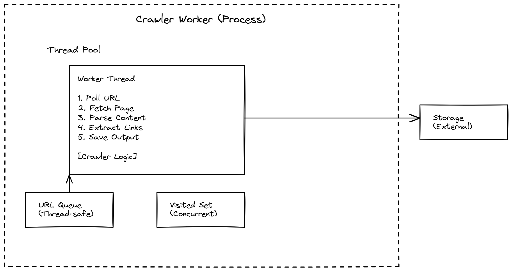
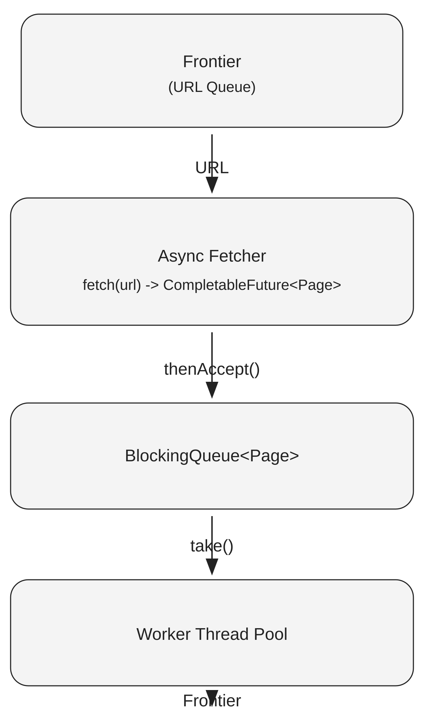

# Web Crawler System Design

This repo explores the design and evolution of a web crawler,
starting from a single-node multithreaded worker and progressing toward
a distributed crawler architecture.

The focus is on **system design, architecture, and scalability**, not
just crawling functionality.

------------------------------------------------------------------------

## Overview

The crawler processes pages using a two-stage pipeline:

URL → Async Fetch (I/O) → FetchedPageQueue → Worker Parse/Store (CPU)

This separation keeps network I/O independent from parsing and storage.

As the system evolves, the crawler transitions from in-memory
coordination to **distributed coordination using Redis**, enabling
multiple crawler nodes to share work.

Core entry points:

- `Main.java` — composition root (wires dependencies)
- `Crawler.java` — represents a crawler node

------------------------------------------------------------------------

## Design Goals

This project focuses on:

- clean **object-oriented design (OOP)**
- clear **separation of responsibilities**
- extensibility via **interfaces and composition**
- evolving from a **single-node system** to a **distributed system**

Key components:

- `Crawler` — orchestrates crawling at the node level
- `WorkerTask` — consumes fetched pages and performs parse/store/link expansion
- `Frontier` — abstraction for URL storage
- `VisitedTracker` — abstraction for deduplication
- `Fetcher` — asynchronously retrieves web pages
- `Parser` — extracts links and content
- `Storage` — handles output
- `ComponentFactory` — centralizes dependency creation

------------------------------------------------------------------------

## Current Architecture (LLD)

The current implementation began as a **single-node crawler worker**.

Multiple threads consume URLs from a shared queue and process them
concurrently.



### Async I/O and CPU Worker Separation (LLD)

This LLD shows the async fetch stage (I/O) separated from multithreaded
blocking worker processing (CPU):



------------------------------------------------------------------------

## Design Evolution

The system evolves in stages:

### 1. Single-Node Multithreaded Crawler

- in-memory queue
- shared visited set
- thread pool execution

---

### 2. Component Abstraction

- introduced interfaces (`Frontier`, `Fetcher`, etc.)
- decoupled implementation from usage
- enabled pluggable components

---

### 3. Distributed Frontier (Redis)

- replaced in-memory queue with `RedisFrontier`
- multiple crawler nodes share a central queue
- enables horizontal scaling

---

### 4. Distributed Deduplication

- introduced `RedisVisitedTracker`
- prevents duplicate crawling across nodes

---

### 5. Scheduler (Decorator Pattern)

- introduced `FrontierScheduler` as a **decorator**
- wraps a shared frontier (e.g., Redis)
- adds crawl politeness (rate limiting per host)
- keeps storage and decision logic separate

Execution flow:

Worker → Scheduler → Frontier → Redis

---

### 6. Async Fetch + Processing Queue

- `Fetcher` returns `CompletableFuture<Page>`
- network fetch and CPU parsing are decoupled
- fetched pages are passed through a blocking queue to worker threads
- architecture is now ready for scaling fetch and processing independently

------------------------------------------------------------------------

## Design Patterns Used

- **Strategy Pattern**
  - `Frontier` interface with multiple implementations
- **Decorator Pattern**
  - `FrontierScheduler` adds scheduling behavior without modifying storage
- **Factory Pattern**
  - `ComponentFactory` creates pluggable components
- **Dependency Injection**
  - dependencies are created in `Main` and passed to the system

------------------------------------------------------------------------

## Distributed Architecture

The system supports multiple crawler nodes:

```
Crawler Node A
Crawler Node B
Crawler Node C
        ↓
   Redis (Frontier + Visited)
```

Each node:

- pulls URLs from Redis
- processes them independently
- contributes results back to the shared system

------------------------------------------------------------------------

## Design Alternatives

This project explores multiple scheduling approaches:

- **Decorator-based Scheduler**  
  Uses a shared frontier wrapped by a scheduler (`FrontierScheduler`)
  to enforce politeness while keeping concerns separated.

- **Host-Based Frontier (next stage)**  
  Moves scheduling into the frontier using per-host queues for improved
  efficiency and avoids retry loops.

The decorator-based implementation is available in:
`feature/decorator-scheduler` branch.

------------------------------------------------------------------------

## Running the Project

### Compile and run (simple mode)

```bash
mvn -q -DskipTests compile
mvn -q exec:java -Dexec.mainClass=Main
```

### Distributed mode (with Redis)

Start Redis:

```bash
docker run -p 6379:6379 redis
```

Run the crawler:

```bash
java -Dfrontier.type=redis -Dvisited.type=redis -jar target/mtWebCrawler-1.0-SNAPSHOT.jar
```

To simulate multiple nodes, run the command in multiple terminals.

------------------------------------------------------------------------

## Future Improvements

- host-based frontier (efficient scheduling)
- min-heap scheduler (no retry loops)
- global politeness coordination
- priority-based crawling
- persistent storage (S3 / database)
- fault tolerance and retry strategies

------------------------------------------------------------------------

## Summary

This project demonstrates how a simple crawler evolves into a
**distributed system** through:

- abstraction
- composition
- separation of concerns
- incremental architectural improvements

The goal is to model the core ideas behind real-world crawling systems
while keeping the design clear and extensible.
